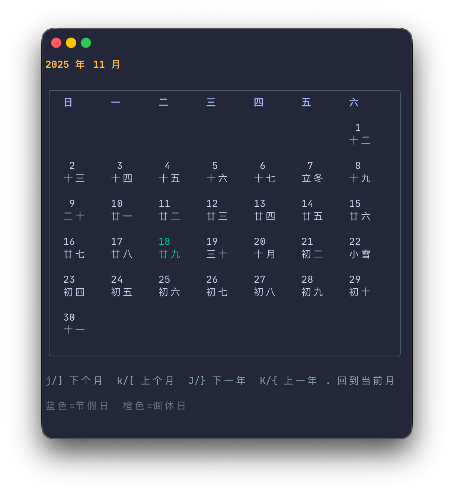

# lucal (Go + Bubble Tea)

Modern TUI rewrite of the legacy `lucal` lunar calendar CLI. It keeps the original
usage semantics while adding an interactive Bubble Tea interface as the default
experience.



## Features

- Interactive TUI by default with smooth keyboard navigation
- Non-interactive (`-n`) mode that renders legacy-style output using Bubble Tea's
  table component
- Accurate lunar information powered by
  [`github.com/Lofanmi/chinese-calendar-golang`](https://github.com/Lofanmi/chinese-calendar-golang)
- Automatic terminal-width aware layout that caps yearly views to at most 3
  months per row
- GBK-aware width calculations so Chinese text aligns cleanly with ASCII labels
- **Holiday highlighting**: Chinese public holidays displayed in blue, workdays (调休) in orange
- **Automatic holiday data updates**: Download latest holiday data with `-u` flag

## Requirements

- Go 1.22+
- macOS/Linux terminal (Windows works via WSL)
- Years between **1900** and **3000** (limitation of the upstream
  Chinese-calendar dataset)

### Install

#### Homebrew

```bash
brew install lululau/utils/lucal
```

#### From source

```bash
go install github.com/lululau/lucal/cmd/lucal@latest
```

## Build & Run

```bash
git clone https://github.com/lululau/lucal.git
cd lucal
go build ./cmd/lucal
./lucal            # interactive calendar for current month
./lucal -n -y 2024 # one-shot render for 2024
```

### CLI Usage

```
lucal               # 当前月（交互式）
lucal -y            # 当前年
lucal 9             # 当年9月
lucal 1983          # 公元1983年
lucal 2012 12       # 2012年12月
lucal -y 9          # 公元9年的全年（受限于数据源，1900 年以前会报错）
lucal -n …          # 非交互模式，渲染输出后立即退出
lucal -u            # 下载最新的节假日数据
lucal -h <file>     # 指定节假日数据文件（用于调试）
```

### Interactive Shortcuts

| Key        | Action                           |
| ---------- | -------------------------------- |
| `k/[` / `j/]`  | Previous / next month            |
| `K/{` / `J/}`  | Previous / next year             |
| `.`        | Jump back to the current month   |
| `y`        | Enter year input dialog          |
| `m`        | Enter month input dialog         |
| `q`        | Quit                             |
| `Esc`      | Cancel current input dialog      |

Tip: the year prompt accepts either `YYYY` or `YYYY MM`, so `y` → `2025 10`
instantly jumps到 2025年10月。

### Holiday Data

The calendar can highlight Chinese public holidays and workdays (调休):
- **Holidays** are displayed in **blue**
- **Workdays** (调休) are displayed in **orange**
- **Today** is displayed in **green** (unless it's a holiday/workday)

Holiday data is automatically loaded from the XDG cache directory (`~/.cache/lucal/holidays.json`).
If the cache doesn't exist or is older than 6 months, a reminder will be shown at the bottom
of the calendar to update the data.

To update holiday data:
```bash
lucal -u
# or
lucal --update-holidays
```

This will download the latest holiday data from GitHub and save it to the cache directory.
The download progress is displayed with a progress bar showing speed and file size.

For development/debugging, you can specify a custom holiday data file:
```bash
lucal -h ./holidays.json
# or
lucal --holidays-file ./holidays.json
```

## Development

```bash
go test ./...
go run ./cmd/lucal --help
```

During development you can run the app in plain mode to inspect layout changes:

```bash
go run ./cmd/lucal -n -y 2025
```

## Limitations

- The lunar data source only supports 1900–3000; earlier years will show a clear
  error message.
- GBK-based width detection works best with Simplified Chinese fonts. Mixed
  emoji/rare characters fall back to a runewidth approximation.

## Troubleshooting

- **Year view is tall**: pipe `lucal -n -y <year>` into a pager like `less -R`
  for easier scrolling.
- **Colors look weird**: Ensure your terminal supports 24-bit colors. Set
  `COLORTERM=truecolor` if necessary.

